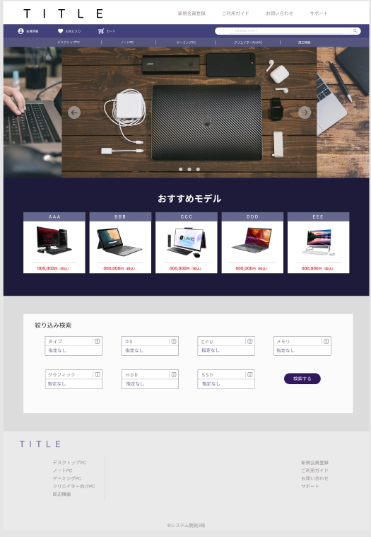

### 画面詳細図
## トップページ
### プロトタイプは以下のリンク先
[プロトタイプ](https://www.figma.com/file/wcRIGueq4vM1sdFyJs55Xj/%E7%94%BB%E9%9D%A2%E3%83%87%E3%82%B6%E3%82%A4%E3%83%B3?node-id=0%3A1)

******

補足：対応DBの列はDB設計後、〇を対応するテーブル・カラムに差し替えること。

[ヘッダー](https://github.com/Aso2001011/SD2A03Dev/blob/main/%E7%94%BB%E9%9D%A2%E8%A9%B3%E7%B4%B0%E5%9B%B3/%E3%83%98%E3%83%83%E3%83%80%E3%83%BC.md)

| ID | 要素 | 内容 | アクション | イベント |　対応DB |
|----|------|------|------------|---------|--------------|
|1|サイト名|ボタン|クリック|トップページへ遷移|-|
|2|会員情報|ボタン|クリック|会員情報ページへ移動|-|
|3|お気に入り|ボタン|クリック|お気に入りページへ移動|-|
|4|カート|ボタン|クリック|カートへ移動|-|
|5|デスクトップPC|ボタン|クリック|デスクトップPC一覧ページへ移動|-|
|6|ノートPC|ボタン|クリック|ノートPC一覧ページへ移動|-|
|7|ゲーミングPC|ボタン|クリック|ゲーミングPC一覧ページへ移動|-|
|8|クリエイター向けPC|ボタン|クリック|クリエイター向けPC一覧ページへ移動|-|
|9|周辺機器|ボタン|クリック|周辺機器一覧ページへ移動|-|
|10|検索バナー|入力欄|テキスト入力|検索内容表示|-|
|11|画像|画像|スクロール|次の画像に切り替わる|-|
|12|おすすめモデル|テキスト|-|-|-|
|12|おすすめPC|ボタン|クリック|商品詳細ページへ移動|-|
|13|絞り込み検索|セレクトボックス|クリック|-|-|
|14|検索する|ボタン|クリック|セレクトボックスの内容をもとに検索結果ページへ移動|-|
|15|新規会員登録|ボタン|クリック|新規会員登録ページへ移動|-|

