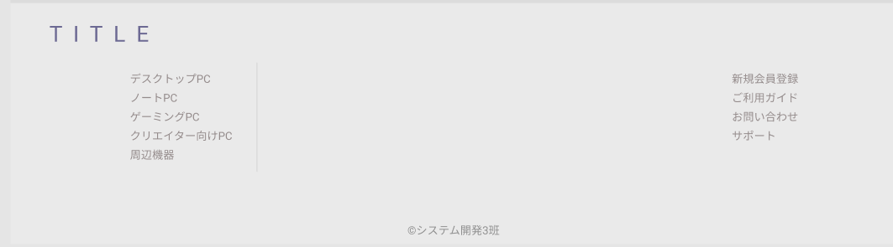

### 画面詳細図
## フッター
### プロトタイプは以下のリンク先
[プロトタイプ](https://www.figma.com/file/wcRIGueq4vM1sdFyJs55Xj/%E7%94%BB%E9%9D%A2%E3%83%87%E3%82%B6%E3%82%A4%E3%83%B3?node-id=0%3A1)

******

補足：対応DBの列はDB設計後、〇を対応するテーブル・カラムに差し替えること。

| ID | 要素 | 内容 | アクション | イベント |　対応DB |
|----|------|------|------------|---------|--------------|
|1|サイト名|ボタン|クリック|トップページへ遷移|-|
|2|新規会員登録|ボタン|クリック|新規会員登録ページへ移動|-|
|3|会員情報|ボタン|クリック|会員情報ページへ移動|-|
|4|お気に入り|ボタン|クリック|お気に入りページへ移動|-|
|5|カート|ボタン|クリック|カートへ移動|-|
|6|デスクトップPC|ボタン|クリック|デスクトップPC一覧ページへ移動|-|
|7|ノートPC|ボタン|クリック|ノートPC一覧ページへ移動|-|
|8|ゲーミングPC|ボタン|クリック|ゲーミングPC一覧ページへ移動|-|
|9|クリエイター向けPC|ボタン|クリック|クリエイター向けPC一覧ページへ移動|-|
|10|周辺機器|ボタン|クリック|周辺機器一覧ページへ移動|-|
|11|©システム開発3班|テキスト|-|-|-|

